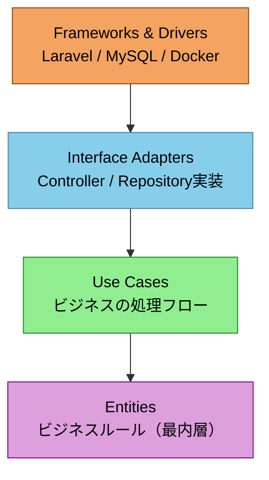
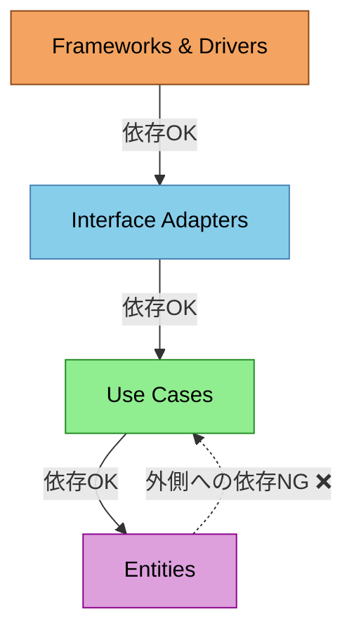
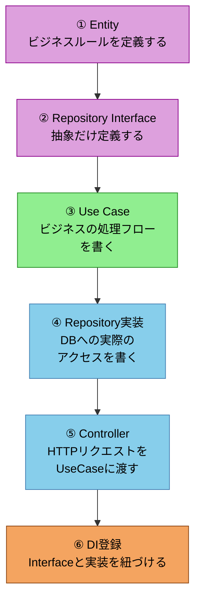
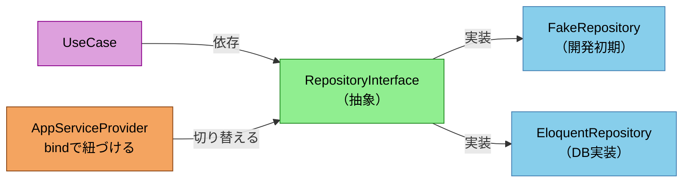
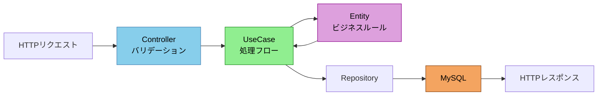

# クリーンアーキテクチャ入門

---

## アジェンダ

- クリーンアーキテクチャとは何か
- 4つの層
- 依存関係のルール
- DI の仕組み
- リクエストの流れ

---

## クリーンアーキテクチャとは

MVC の課題を解決するために Robert C. Martin（Uncle Bob）が 2012 年に提唱。

- ビジネスロジックをフレームワーク・DB から独立させる
- 内側の層は外側の層を知らない
- DB なしでビジネスロジックをテストできる

---

## 4つの層

---

## 依存関係のルール

---

## 開発手順

**内側から外側へ**の順番で作るのが基本。

---

## DI の仕組み

---

## リクエストの流れ

---

## まとめ

- **内側の層はフレームワーク・DBを知らない**
- **依存は必ず内側へ**
- **Repository を差し替えるだけで DB を変えられる**
- **DB なしでビジネスロジックをテストできる**
